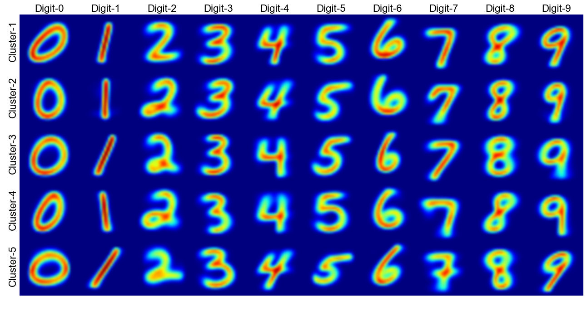
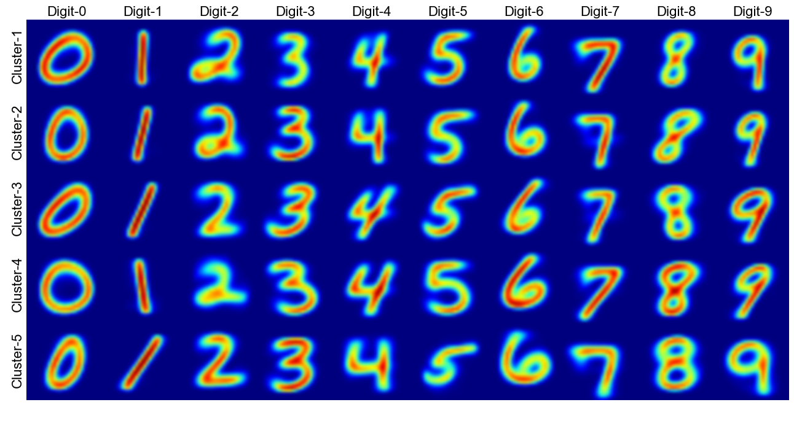
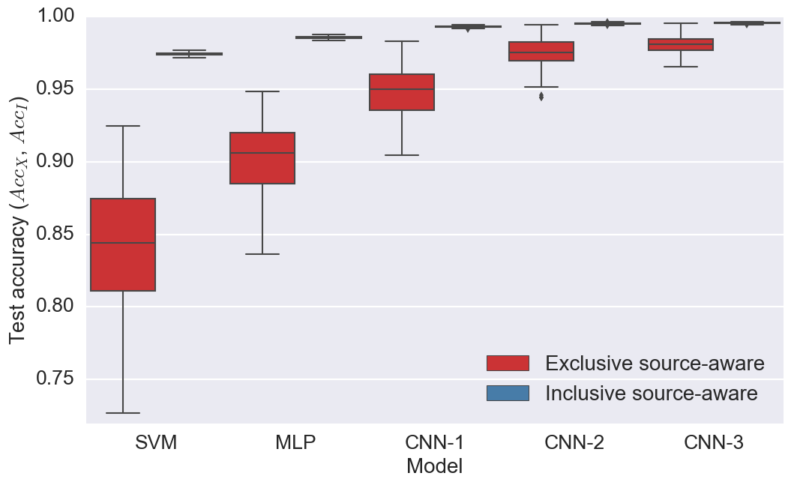
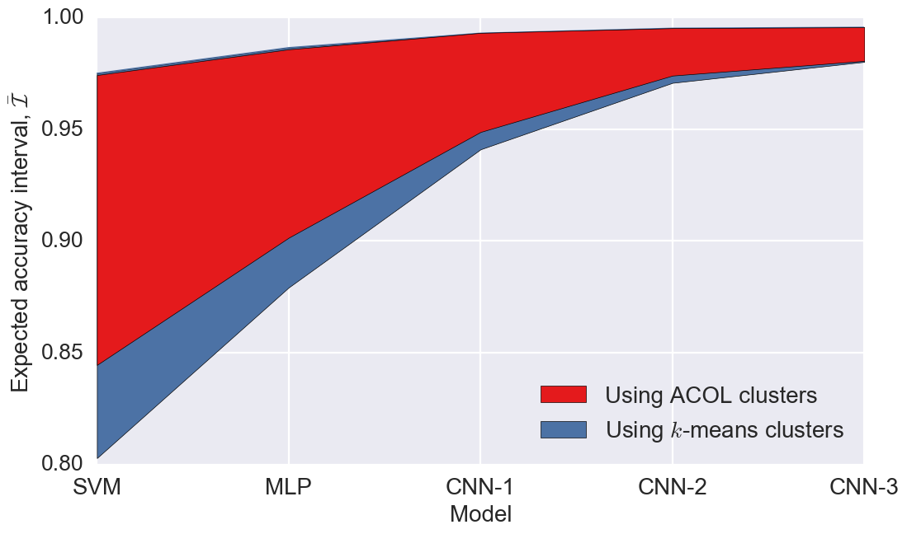
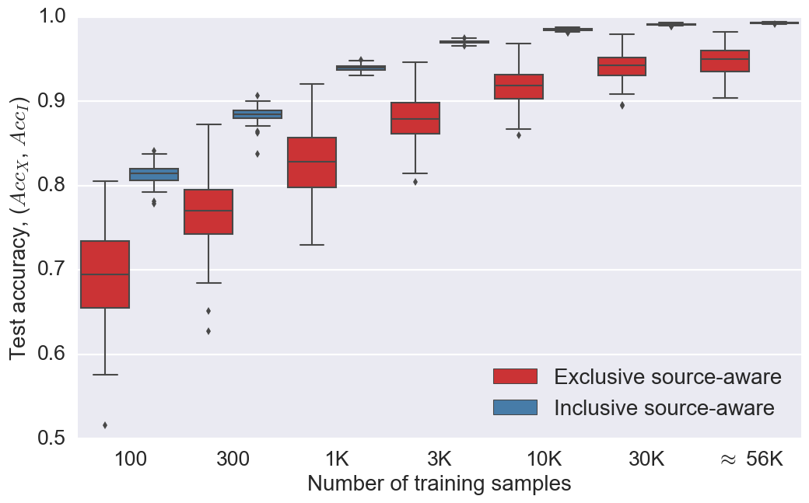
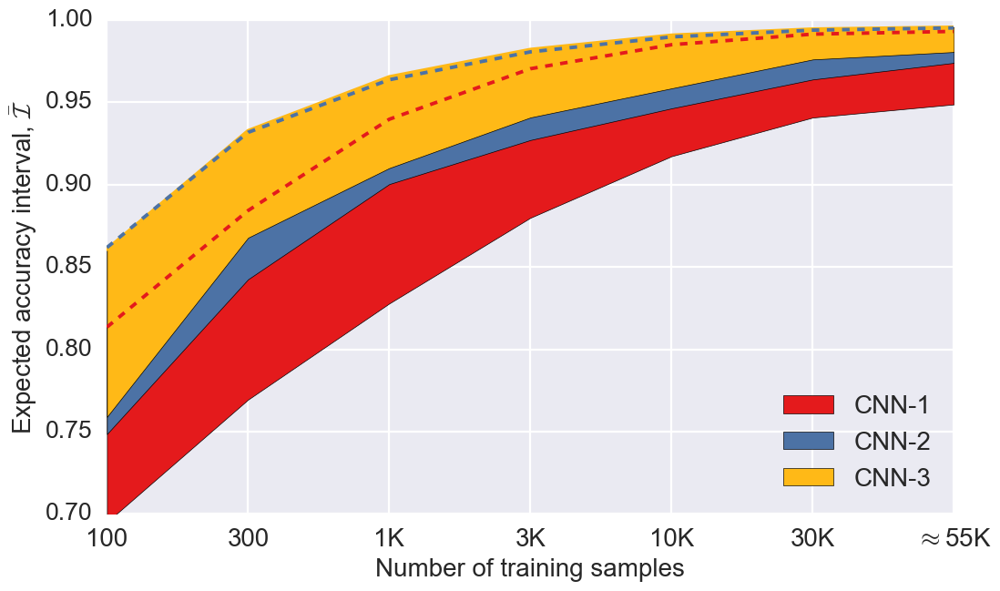
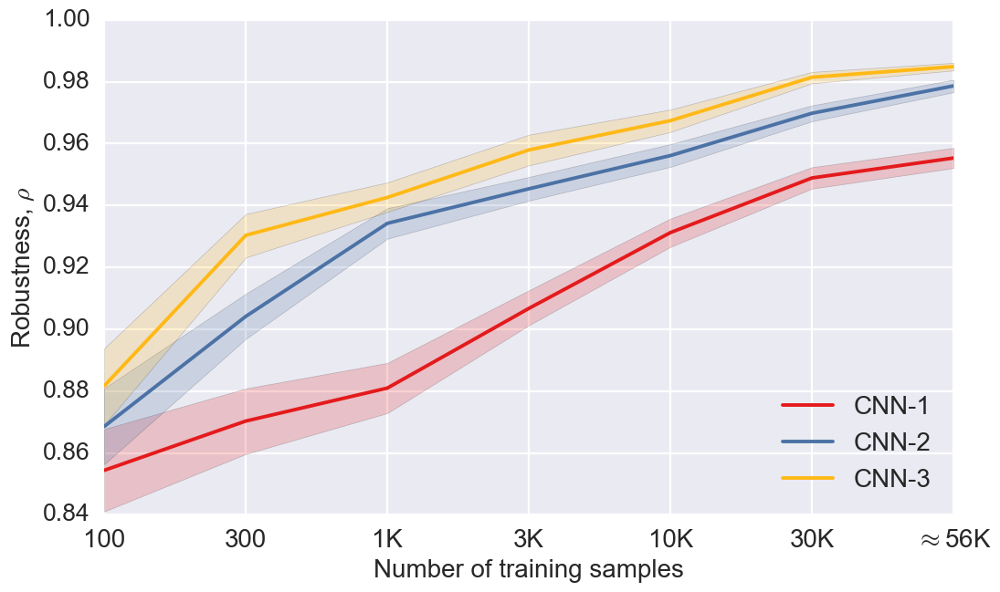
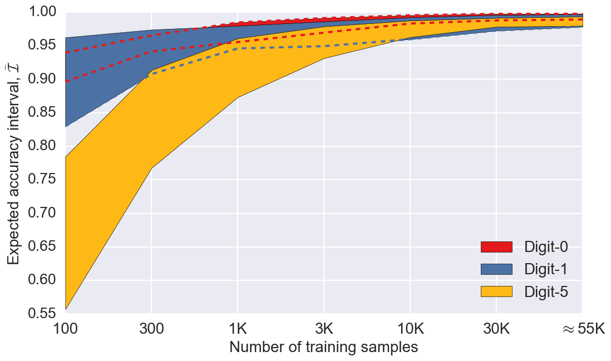
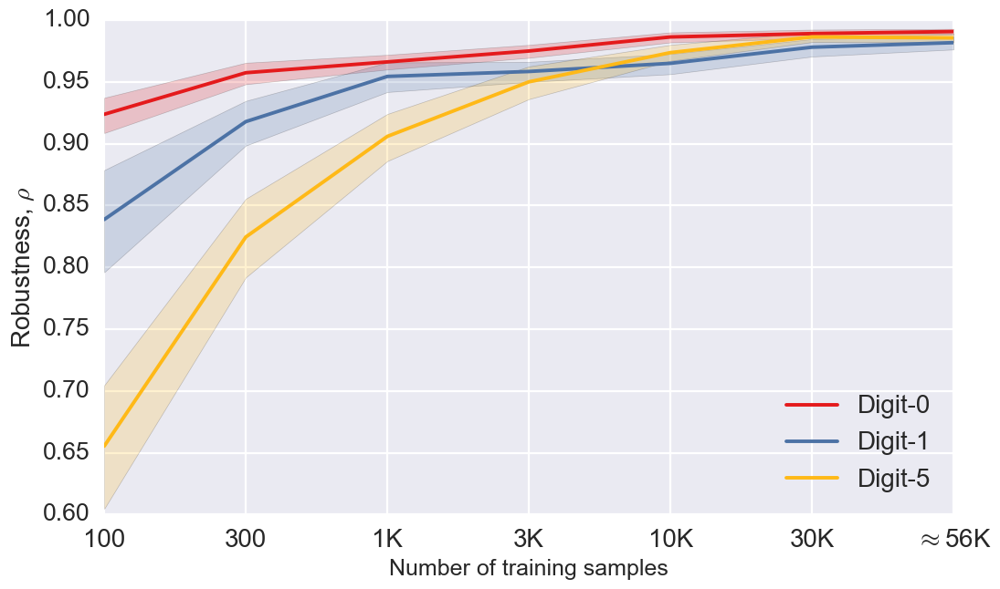

```python
from __future__ import print_function

import numpy as np
import scipy as sc
import pandas as pd
import matplotlib.pyplot as plt
import matplotlib.cm as cm
import matplotlib.gridspec as gridspec
import seaborn as sns


np.random.seed(1337)  # for reproducibility
%matplotlib inline

from cycler import cycler 

from mpl_toolkits.mplot3d import Axes3D
from matplotlib import cm
from matplotlib import rc

from matplotlib import font_manager

plt.rcParams['lines.linewidth'] = 2
plt.rcParams['axes.prop_cycle'] = cycler('color', [cm.Set1(i) for i in np.linspace(0, 1, 10)])
plt.rcParams['axes.grid'] = True
plt.rcParams['axes.labelsize'] = 'medium'
plt.rcParams['axes.labelweight'] = 'normal'
plt.rcParams['axes.titlesize'] = 'medium'
plt.rcParams['axes.titleweight'] = 'normal'
plt.rcParams['font.size'] = 14
plt.rcParams['font.serif'] = 'Helvetica'
plt.rcParams['font.weight'] = 'normal'

plt.rcParams['legend.fontsize'] = 'medium'
plt.rcParams['legend.fancybox'] = True
plt.rcParams['legend.shadow'] = True
rc('legend', numpoints = 2)
rc('legend', fontsize = 'large')

a=np.linspace(0, 1, 10)
rc('axes', prop_cycle=cycler('color', [cm.Set1(i) for i in a]))

b=np.linspace(0.00, 1, 10)

def plot_class_means(nb_classes, nb_clusters, est, test, cmap, boundary, ax=None):
    if ax is None:
        ax = plt.gca()
        
    n,h,w,d = test.shape
    
    img = np.zeros((h*nb_clusters,w*nb_classes))
    imgSorted = np.zeros_like(img)
    ind = np.zeros((nb_clusters, nb_classes))
    for i in range(nb_clusters):
        for j in range(nb_classes):
            a = test[boundary,:][est[boundary]==j+nb_classes*i]
            b = a.shape[0]
            if b == 0:
                a = np.zeros((h,w))
            else:
                a = a.mean(axis=0).reshape(h,w)
            ind[i,j] = b
            img[i*h:(i+1)*h,j*w:(j+1)*w] = a 
    
    for i in range(nb_clusters):
        for j in range(nb_classes):
            k = ind.argsort(axis=0)[::-1][i,j]
            imgSorted[i*h:(i+1)*h,j*w:(j+1)*w] = img[k*h:(k+1)*h,j*w:(j+1)*w]
        
    fig = ax.imshow(imgSorted,cmap=cmap, interpolation='bicubic')

    ax.axis('off')
    ax.grid('off')
    
        
    return fig

def robustness_constant(acc1, acc2):
    return 1-np.abs(acc1-acc2)/acc1
```


```python
from keras.datasets import mnist
from keras.utils import np_utils

# input image dimensions
img_rows, img_cols, img_channels,  = 28, 28, 1
input_shape=(img_rows, img_cols, img_channels)

# the data, shuffled and split between train and test sets
(X_train, y_train), (X_test, y_test) = mnist.load_data()

X_train = X_train.reshape(X_train.shape[0], img_rows, img_cols, img_channels)
X_test = X_test.reshape(X_test.shape[0], img_rows, img_cols, img_channels)

X_train = X_train.astype('float32')
X_test = X_test.astype('float32')
X_train /= 255
X_test /= 255

# convert class vectors to binary class matrices
nb_classes = 10
Y_train = np_utils.to_categorical(y_train, nb_classes)
Y_test = np_utils.to_categorical(y_test, nb_classes)
```

    Using Theano backend.


```python
main_loc = "/Users/ozsel/git/phdwork/Robustness/files/"

exc_cnn_all = np.zeros((7,3,100))
k = 0
for i in [100,300, 1000, 3000, 10000, 30000, 60000]:
    for j in [1,2,3]:
        load_loc1 = main_loc + 'CNN' + str(j) + '/acc_x_' + str(i) + '.npy'
        foo = np.load(load_loc1)[:,3,:].max(axis=1)
        exc_cnn_all[k,j-1,:] = foo[np.random.permutation(foo.shape[0])][0:100]
    k += 1
    
inc_cnn_all  = np.zeros((7,3,100))
k = 0
for i in [100,300, 1000, 3000, 10000, 30000, 60000]:
    for j in [1,2,3]:
        load_loc1 = main_loc + 'CNN' + str(j) + '/acc_i_' + str(i) + '.npy'
        foo = np.load(load_loc1)[:,3,:].max(axis=1)
        inc_cnn_all[k,j-1,:] = foo[np.random.permutation(foo.shape[0])][0:100]
    k += 1
    
exc_full  = np.zeros((5,100))
exc_full[0,:] = np.load(main_loc + 'SVM/acc_x_60000.npy')
exc_full[1,:] = np.load(main_loc + 'MLP/acc_x_60000.npy')[:,3,:].max(axis=1)
exc_full[2,:] = np.load(main_loc + 'CNN1/acc_x_60000.npy')[:,3,:].max(axis=1)
exc_full[3,:] = np.load(main_loc + 'CNN2/acc_x_60000.npy')[:,3,:].max(axis=1)
exc_full[4,:] = np.load(main_loc + 'CNN3/acc_x_60000.npy')[:,3,:].max(axis=1)

inc_full  = np.zeros((5,100))
inc_full[0,:] = np.load(main_loc + 'SVM/acc_i_60000.npy')
inc_full[1,:] = np.load(main_loc + 'MLP/acc_i_60000.npy')[:,3,:].max(axis=1)
inc_full[2,:] = np.load(main_loc + 'CNN1/acc_i_60000.npy')[:,3,:].max(axis=1)
inc_full[3,:] = np.load(main_loc + 'CNN2/acc_i_60000.npy')[:,3,:].max(axis=1)
inc_full[4,:] = np.load(main_loc + 'CNN3/acc_i_60000.npy')[:,3,:].max(axis=1)

exc_full_kmeans  = np.zeros((5,10))
exc_full_kmeans[0,:] = np.load(main_loc + 'UsingKmeans/SVM/acc_x_60000.npy')
exc_full_kmeans[1,:] = np.load(main_loc + 'UsingKmeans/MLP/acc_x_60000.npy')[:,3,:].max(axis=1)
exc_full_kmeans[2,:] = np.load(main_loc + 'UsingKmeans/CNN1/acc_x_60000.npy')[:,3,:].max(axis=1)
exc_full_kmeans[3,:] = np.load(main_loc + 'UsingKmeans/CNN2/acc_x_60000.npy')[0:10,3,:].max(axis=1)
exc_full_kmeans[4,:] = np.load(main_loc + 'UsingKmeans/CNN3/acc_x_60000.npy')[:,3,:].max(axis=1)

inc_full_kmeans  = np.zeros((5,10))
inc_full_kmeans[0,:] = np.load(main_loc + 'UsingKmeans/SVM/acc_i_60000.npy')
inc_full_kmeans[1,:] = np.load(main_loc + 'UsingKmeans/MLP/acc_i_60000.npy')[:,3,:].max(axis=1)
inc_full_kmeans[2,:] = np.load(main_loc + 'UsingKmeans/CNN1/acc_i_60000.npy')[:,3,:].max(axis=1)
inc_full_kmeans[3,:] = np.load(main_loc + 'UsingKmeans/CNN2/acc_i_60000.npy')[0:10,3,:].max(axis=1)
inc_full_kmeans[4,:] = np.load(main_loc + 'UsingKmeans/CNN3/acc_i_60000.npy')[:,3,:].max(axis=1)

exc_class_cnn = np.zeros((7,100,10))
k = 0
j=3
for i in [100,300, 1000, 3000, 10000, 30000, 60000]:
    load_loc1 = main_loc + 'CNN' + str(j) + '/class_acc_x_' + str(i) + '.npy'
    exc_class_cnn[k,:,:] = np.load(load_loc1)
    k += 1
    
    
inc_class_cnn = np.zeros((7,100,10))
k = 0
for i in [100,300, 1000, 3000, 10000, 30000, 60000]:
    load_loc1 = main_loc + 'CNN' + str(j) + '/class_acc_i_' + str(i) + '.npy'
    inc_class_cnn[k,:,:] = np.load(load_loc1)[0:100,:]
    k += 1
    
inc_class_cnn[inc_class_cnn==0]=np.nan
exc_class_cnn[exc_class_cnn==0]=np.nan

rb = robustness_constant(inc_cnn_all, exc_cnn_all)
rb_model = robustness_constant(inc_full, exc_full)
rb_class = robustness_constant(inc_class_cnn, exc_class_cnn)
rb_model_kmeans = robustness_constant(inc_full_kmeans, exc_full_kmeans)

est = np.load(main_loc + '/robust_validation_est.npy')
est_kmean= np.load(main_loc + '/robust_validation_est_kmeans.npy')

overwrite = False
```


```python
fig = plt.figure(figsize=(16,8))
ax1 = fig.add_subplot(111)
plot_class_means(10,5,est, np.concatenate((X_train,X_test),axis=0) ,cm.jet,range(0,70000,1),ax1)

for i in range(10):
    ax1.text(7+i*28, -2, 'Digit-' + str(i), fontsize=16, color = 'black')

for i in range(5):
    ax1.text(-6, 6+i*28, 'Cluster-' + str(i+1), fontsize=16, color = 'black', rotation='vertical')
    
if overwrite:
    plt.savefig('../../Ph.D/2017 - UAI/figures/clusters.pdf', format='pdf', bbox_inches='tight')
```





```python
fig = plt.figure(figsize=(16,8))
ax1 = fig.add_subplot(111)
plot_class_means(10,5,est_kmean, np.concatenate((X_train,X_test),axis=0) ,cm.jet,range(0,70000,1),ax1)

for i in range(10):
    ax1.text(7+i*28, -2, 'Digit-' + str(i), fontsize=16, color = 'black')

for i in range(5):
    ax1.text(-6, 6+i*28, 'Cluster-' + str(i+1), fontsize=16, color = 'black', rotation='vertical')
    
if overwrite:
    plt.savefig('../../Ph.D/2017 - UAI/figures/clusters_kmeans.pdf', format='pdf', bbox_inches='tight')
```





```python
foo = np.zeros((10,100))
for i in range(5):
    foo[i*2,:] = exc_full[i,:]
    foo[i*2+1,:] = inc_full[i,:]

k = 0
df = pd.DataFrame(data=np.zeros((1000,3)),columns=['Model','Partition Type','Accuracy'])
foo_list = []
for modelType in ['SVM', 'MLP', 'CNN-1', 'CNN-2', 'CNN-3']:
    for partType in ['Exclusive source-aware', 'Inclusive source-aware']:
        foo_list = []
        model = []
        for i in range(100):
            model.append(modelType)
        partition = []
        for i in range(100):
            partition.append(partType)
            
        foo_list.append(model)
        foo_list.append(partition)
        foo_list.append(foo[k,:].T)

        df.loc[k*100:k*100+99] = map(list, zip(*foo_list))
        k += 1
        
```


```python
plt.figure(figsize=((12,7)))
ax1 = plt.subplot(111)
# Draw a nested boxplot to show bills by day and sex
sns.set(context='poster',style='darkgrid', palette='Set1', font_scale=1.2)
sns.boxplot(x="Model", y="Accuracy", hue="Partition Type", data=df, ax=ax1,linewidth=1.5, width=.95)
sns.despine(offset=0, trim=False)

ax1.set_ylabel('Test accuracy ($Acc_X$, $Acc_I$)', fontsize=20)
ax1.set_xlabel('Model', fontsize=20)
ax1.set_ylim(0.72,1)
ax1.legend(loc = 'lower right', fontsize=20)
if overwrite:
    plt.savefig('../../Ph.D/2017 - UAI/figures/models_acc.pdf', format='pdf', bbox_inches='tight')
```





```python
plt.figure(figsize=(12,7))
ax1 = plt.subplot(111)

ax1.fill_between(range(0,5), exc_full.mean(axis=1), 
                             inc_full.mean(axis=1), 
                             facecolor=cm.Set1(b[0]), alpha=1, zorder=3, label='Using ACOL clusters')

ax1.plot(inc_full_kmeans.mean(axis=1), '-',color=cm.Set1(b[1]),alpha=1, linewidth=1)
ax1.fill_between(range(0,5), exc_full_kmeans.mean(axis=1), 
                             inc_full_kmeans.mean(axis=1), 
                             facecolor=cm.Set1(b[1]), alpha=1, zorder=2, label='Using $k$-means clusters')

ax1.set_xlabel('Model', fontsize=20)
ax1.set_xticklabels(['SVM', 'MLP', 'CNN-1', 'CNN-2', 'CNN-3'], fontsize=20)
ax1.set_xticks([0,1,2,3,4])
ax1.set_ylim(0.80,1)
ax1.set_ylabel(r'Expected accuracy interval, $\mathcal{\bar{I}}$' , fontsize=20)
ax1.legend(loc='lower right', fontsize=20)
if overwrite:
    plt.savefig('../../Ph.D/2017 - UAI/figures/cluster_comparison_interval.pdf', format='pdf', bbox_inches='tight')
```





```python
plt.figure(figsize=(12,7))
ax1 = plt.subplot(111)

sns.set(context='poster',style='darkgrid', palette='Set1',font_scale=1.2)
sns.tsplot(data=rb_model[:,0:100].T,color=cm.Set1(b[0]),condition='Using ACOL clusters',ci=95, alpha=1)
sns.tsplot(data=rb_model_kmeans.T,color=cm.Set1(b[1]),condition='Using $k$-means clusters',ci=95, alpha=1)
sns.despine(offset=0, trim=True)

ax1.set_xlabel('Model', fontsize=20)
ax1.set_xticklabels(['SVM', 'MLP', 'CNN-1', 'CNN-2', 'CNN-3'], fontsize=20)
ax1.set_xticks([0,1,2,3,4])
#ax1.set_ylim(0,0.09)
ax1.set_ylabel(r'Robustness, $\rho$', fontsize=20)
ax1.legend(loc='lower right', fontsize=20)
if overwrite:
    plt.savefig('../../Ph.D/2017 - UAI/figures/cluster_comparison.pdf', format='pdf', bbox_inches='tight')
```


```python
foo = np.zeros((14,3,100))
for i in range(7):
    for j in range(3):
        foo[i*2,j,:] = exc_cnn_all[i,j,:]
        foo[i*2+1,j,:] = inc_cnn_all[i,j,:]

k = 0
df = pd.DataFrame(data=np.zeros((1400,4)),columns=['Model','Partition Type','Number of training samples','Accuracy'])
foo_list = []
for sizeType in ['100', '300', '1K', '3K', '10K', '30K', r'$\approx$ 56K']:
    for partType in ['Exclusive source-aware', 'Inclusive source-aware']:  
        j = 0
        for modelType in ['CNN-1']:
            foo_list = []
            model = []
            for i in range(100):
                model.append(modelType)
            partition = []
            for i in range(100):
                partition.append(partType)
            size = []
            for i in range(100):
                size.append(sizeType)
                
            foo_list.append(model)
            foo_list.append(partition)
            foo_list.append(size)
            foo_list.append(foo[k,j,:].T)
        df.loc[k*100:k*100+99] = map(list, zip(*foo_list))
        k += 1
        
```


```python
plt.figure(figsize=((12,7)))
ax1 = plt.subplot(111)
# Draw a nested boxplot to show bills by day and sex
sns.set(context='poster',style='darkgrid', palette='Set1', font_scale=1.2)
sns.boxplot(x="Number of training samples", y="Accuracy", hue="Partition Type", data=df, ax=ax1, linewidth=1.5,width=.95)
sns.despine(offset=0, trim=False)
ax1.set_ylabel('Test accuracy, ($Acc_X$, $Acc_I$)', fontsize=20)
ax1.set_xlabel('Number of training samples', fontsize=20)
ax1.set_ylim(0.50,1)
ax1.legend(loc='lower right', fontsize=20)
if overwrite:
    plt.savefig('../../Ph.D/2017 - UAI/figures/dataset_size_acc.pdf', format='pdf', bbox_inches='tight')
```





```python
plt.figure(figsize=(12,7))
ax1 = plt.subplot(111)


ax1.fill_between(range(0,7), exc_cnn_all[:,0,:].mean(axis=1), 
                             inc_cnn_all[:,0,:].mean(axis=1), 
                             facecolor=cm.Set1(b[0]), alpha=1, zorder=2, label='CNN-1')

ax1.fill_between(range(0,7), exc_cnn_all[:,1,:].mean(axis=1), 
                             inc_cnn_all[:,1,:].mean(axis=1), 
                             facecolor=cm.Set1(b[1]), alpha=1, zorder=2, label='CNN-2')

ax1.plot(inc_cnn_all[:,2,:].mean(axis=1), color = cm.Set1(b[5]), alpha=1)
ax1.fill_between(range(0,7), exc_cnn_all[:,2,:].mean(axis=1), 
                             inc_cnn_all[:,2,:].mean(axis=1), 
                             facecolor=cm.Set1(b[5]), alpha=1, zorder=2, label='CNN-3')

ax1.plot(inc_cnn_all[:,0,:].mean(axis=1), '--', color = cm.Set1(b[0]), alpha=1,zorder=4)
ax1.plot(inc_cnn_all[:,1,:].mean(axis=1), '--', color = cm.Set1(b[1]), alpha=1,zorder=4)

ax1.set_xlabel('Number of training samples', fontsize=20)
ax1.set_xticklabels(['100', '300', '1K', '3K', '10K', '30K', r'$\approx$55K'],fontsize=20 )
ax1.set_ylim(0.70,1)
ax1.set_ylabel(r'Expected accuracy interval, $\mathcal{\bar{I}}$' , fontsize=20)
ax1.legend(loc='lower right', fontsize=20)
if overwrite:
    plt.savefig('../../Ph.D/2017 - UAI/figures/cnn_acc.pdf', format='pdf', bbox_inches='tight')
```





```python
plt.figure(figsize=(12,7))
ax1 = plt.subplot(111)

sns.set(context='poster',style='darkgrid', palette='Set1', font_scale=1.2)
sns.tsplot(data=rb.swapaxes(0,2).swapaxes(1,2),color=cm.Set1([b[0],b[1],b[5]]),condition=['CNN-1','CNN-2','CNN-3'],ci=[95], alpha=1)
sns.despine(offset=0, trim=False)

ax1.set_xlabel('Number of training samples', fontsize=20)
ax1.set_xticklabels(['100', '300', '1K', '3K', '10K', '30K', r'$\approx$56K'] , fontsize=20)
ax1.set_ylim(.84,1)
ax1.set_ylabel(r'Robustness, $\rho$', fontsize=20)
ax1.legend(loc='lower right', fontsize=20)
if overwrite:
    plt.savefig('../../Ph.D/2017 - UAI/figures/cnn_robustness.pdf', format='pdf', bbox_inches='tight')
```





```python
plt.figure(figsize=(12,7))
ax1 = plt.subplot(111)

ax1.fill_between(range(0,7), np.nanmean(exc_class_cnn,axis=1)[:,0], 
                             np.nanmean(inc_class_cnn,axis=1)[:,0], 
                             facecolor=cm.Set1(b[0]), alpha=1, zorder=2, label='Digit-0')

ax1.fill_between(range(0,7), np.nanmean(exc_class_cnn,axis=1)[:,1],  
                             np.nanmean(inc_class_cnn,axis=1)[:,1],  
                             facecolor=cm.Set1(b[1]), alpha=1, zorder=2, label='Digit-1')

ax1.fill_between(range(0,7), np.nanmean(exc_class_cnn,axis=1)[:,5],  
                             np.nanmean(inc_class_cnn,axis=1)[:,5],  
                             facecolor=cm.Set1(b[5]), alpha=1, zorder=2, label='Digit-5')

ax1.plot(np.nanmean(exc_class_cnn,axis=1)[:,0], '--', color = cm.Set1(b[0]), alpha=1,zorder=4)
ax1.plot(np.nanmean(inc_class_cnn,axis=1)[:,0], '--', color = cm.Set1(b[0]), alpha=1,zorder=4)
ax1.plot(np.nanmean(exc_class_cnn,axis=1)[:,1], '--', color = cm.Set1(b[1]), alpha=1,zorder=4)

ax1.set_xlabel('Number of training samples', fontsize=20)
ax1.set_xticklabels(['100', '300', '1K', '3K', '10K', '30K', r'$\approx$55K'] , fontsize=20)
ax1.set_ylim(0.55,1)
ax1.set_ylabel(r'Expected accuracy interval, $\mathcal{\bar{I}}$' , fontsize=20)
ax1.legend(loc='lower right', fontsize=20)
if overwrite:
    plt.savefig('../../Ph.D/2017 - UAI/figures/cnn_class_acc.pdf', format='pdf', bbox_inches='tight')
```





```python
plt.figure(figsize=(12,7))
ax1 = plt.subplot(111)

sns.set(context='poster',style='darkgrid', palette='Set1',font_scale=1.2)
sns.tsplot(data=rb_class.swapaxes(0,1)[:,:,[0,1,5]],color=cm.Set1([b[0],b[1],b[5]]),
           condition=['Digit-0','Digit-1','Digit-5'],estimator=np.nanmean, ci=[95], alpha=1)
sns.despine(offset=0, trim=False)

ax1.set_xlabel('Number of training samples', fontsize=18)
ax1.set_xticklabels(['100', '300', '1K', '3K', '10K', '30K', r'$\approx$56K'] , fontsize=20)
ax1.set_ylim(0.6,1)
ax1.set_ylabel(r'Robustness, $\rho$', fontsize=20)
ax1.legend(loc='lower right', fontsize=20)
if overwrite:
    plt.savefig('../../Ph.D/2017 - UAI/figures/cnn_class_robustness.pdf', format='pdf', bbox_inches='tight')
```




